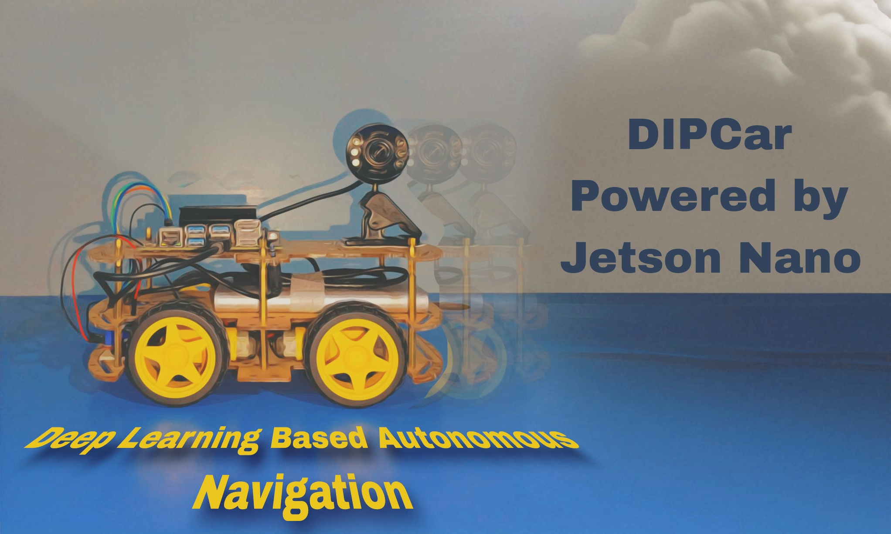

# Deep Learning Based Autonomous Navigation over Economical Hardware



## 🚗 Driving Innovation in Autonomous Navigation

DIPCar is a cutting-edge Final Year Project (FYP) that brings together deep learning and robotics to create an autonomous navigation system using a Jetson Nano. Our project transforms a simple toy car into a smart, self-driving vehicle capable of understanding and reacting to its environment in real-time.

### 🎯 Key Features

- **Object Detection**: Utilizing a custom-trained model to recognize 12 different classes of objects, including vehicles, pedestrians, and traffic signs.
- **Intelligent Decision Making**: Real-time processing of detected objects to control the car's movement.
- **Adaptive Speed Control**: Automatic adjustment of speed based on detected speed limit signs.
- **Safety First**: Immediate response to stop signs, ensuring safe navigation.
- **Scalable Architecture**: Designed for easy expansion and integration of new features.

## 🛠 Tech Stack

- **Hardware**: Jetson Nano, DC motors, Camera module
- **Software**: Python, JetPack SDK, TensorRT
- **Deep Learning Framework**: PyTorch
- **Computer Vision**: OpenCV, jetson-inference

## 🚀 Quick Start

1. ### Jetson Nano Setup
   To begin, assemble the hardware components for the autonomous vehicle. The Jetson Nano 4GB developer kit will serve as the core processing unit, responsible for controlling the motors, sensors and perception systems.

   **Steps to Set Up Jetson Nano**:
   1. Install JetPack SDK on your Jetson Nano from the [NVIDIA website](https://developer.nvidia.com/embedded/jetpack).
   2. Configure GPIO pins for motor and sensor interfacing:
      * Connect DC motors to L298N motor driver.
      * Wire the L298N to the Jetson Nano GPIO pins for motor control.
      * Connect USB camera to the Jetson Nano's USB port for visual input and perception tasks.
      * Mount all hardware components securely to the chassis.
   3. Setup the development environment:
      * Install necessary libraries for AI and computer vision
      * Configure your preferred IDE
   4. Connect the Jetson Nano and motor driver to their respective power supplies to power the system.

   Once the hardware is set up, proceed to the next steps.

2. Clone the repository:
   ```
   git clone https://github.com/wajht7553/DIPCar.git
   ```
   or
   ```
   git clone https://github.com/ImranNawar/DIPCar.git
   ```
3. Install dependencies:
   ```
   pip3 install -r requirements.txt
   ```

4. Run the main control loop:
   ```
   python3 main.py
   ```

## 📁 Project Structure

```
DIPCar/
├── data/
│   ├── calibration/
│   ├── models/
│   ├── preprocessed/
│   └── raw/
├── docs/
├── logs/
├── notebooks/
├── scripts/
├── src/
│   ├── control/
│   ├── perception/
│   └── planning/
└── tests/
```

## 🤝 Contributing

We welcome contributions! Please see our [Contributing Guide](CONTRIBUTING.md) for more details.

## 📄 License

This project is licensed under the [MIT License](LICENSE).

## 🙏 Acknowledgements

- **Dr. Muhammad Sajjad**, Associate Professor, Department of Computer Science
- Digital Image Processing Lab
- Islamia College University, Peshawar
- The open-source community for their invaluable tools and libraries

## 📬 Contact

Wajahat Ullah - wajahatullah235@gmail.com
Imran Nawar - imran1nawar@gmail.com

Project Link: https://github.com/wajht7553/DIPCar

---

DIPCar - Steering the Future of Autonomous Navigation! 🚗💨
